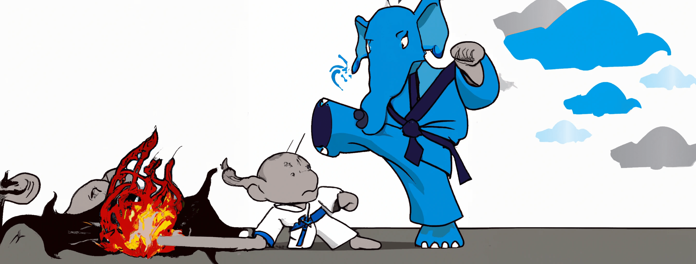
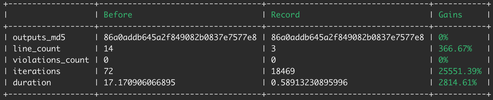

<p align="center">
  <a href="https://www.youtube.com/watch?v=r_8Rw16uscg" target="_blank">
    
  </a>
</p>

<p>
  <a href="https://dl.circleci.com/status-badge/redirect/gh/HendrikPrinsZA/laravel-kata/tree/main">
    
  </a>
  <a href="https://wakatime.com/badge/user/69e63dcc-57e6-4f88-914d-47f7875e06e1/project/87ef3f09-e831-47e5-8f10-99255f5649a8">
    
  </a>
  <a href="https://codecov.io/github/HendrikPrinsZA/laravel-kata">
     
  </a>
</p>

# Laravel Kata
The greatest collection of the worst code.

#### Concepts
- Learn the fundamentals
- Expose common mistakes
- Lab to theorycraft mechanics

#### Scope 
- Sample (done)
- Native PHP (incomplete)
- Laravel Eloquent (incomplete)
- Native MySQL (incomplete)
- Native Redis (pending 1)

## Sample challenge
Calculate the value of `pi`.

```php
class KataChallengeSample
{
  public function calculatePi(int $limit): float
  {
    $denominator = 1;
    $sum = 0;
    for ($i = 0; $i < 100000; $i++) {
      $sum = ($i % 2 === 0)
        ? $sum + (4 / $denominator)
        : $sum - (4 / $denominator);
      $denominator += 2;
    }
    return round($sum, 2);
  }
}

class KataChallengeSampleRecord
{
  public function calculatePi(int $limit): float
  {
    return round(M_PI, 2);
  }
}
```

<p align="center">
  
</p>

## [What are katas?](https://www.youtube.com/watch?v=r_8Rw16uscg)
Katas are code challenges focused on improving skill and technique. Some train programming fundamentals, while others focus on complex problem solving. Some are puzzles meant to test your creative problem solving, while others are based on real world coding scenarios.

> The term was first coined by Dave Thomas, co-author of the book The Pragmatic Programmer as an acknowledgment to the Japanese concept of kata in the martial arts. Dave's version of the concept defines a code kata as an exercise in programming which helps a programmer sharpen their skills through practice and repetition. - [Codewars](https://docs.codewars.com/concepts/kata/)
