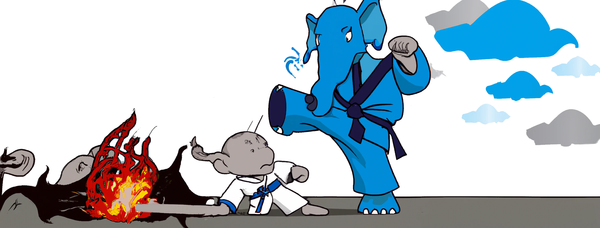

<p align="center">
  <a href="https://www.youtube.com/watch?v=r_8Rw16uscg" target="_blank">
    
  </a>
</p>


<p align="center">
    (Generate badges here)
</p>

## About Laravel Kata
The greatest collection of bad code to be used as challenges to training.

### Concepts
- Learn the fundamentals
- Expose common mistakes
- Playground for theorycrafting

## Katas - [Introduction video](https://www.youtube.com/watch?v=r_8Rw16uscg)
Katas are code challenges focused on improving skill and technique. Some train programming fundamentals, while others focus on complex problem solving. Some are puzzles meant to test your creative problem solving, while others are based on real world coding scenarios.

The term was first coined by Dave Thomas, co-author of the book The Pragmatic Programmer as an acknowledgment to the Japanese concept of kata in the martial arts. Dave's version of the concept defines a code kata as an exercise in programming which helps a programmer sharpen their skills through practice and repetition. - [Codewars](https://docs.codewars.com/concepts/kata/)

### Current 
- Native PHP (draft)
- Laravel Eloquent (draft)

### Future
- Native MySQL
- Native Redis

## Sample challenge
Sample challenge to calculate the value of `pi`.

### Worst
```php
class KataChallengeSample extends KataChallenge {
    public function calculatePi(int $limit): float
    {
        $denominator = 1;
        $sum = 0;
        $precision = 1000000;

        for ($iteration = 0; $iteration < $precision; $iteration++) {
            $sum = ($iteration % 2 === 0)
                ? $sum - (4 / $denominator)
                : $sum + (4 / $denominator);

            $denominator += 2;
        }

        return round($sum, 2);
    }
}
```

### Better
```php 
class KataChallengeSampleRecord extends KataChallengeSample {
    public function calculatePi(int $limit): float {
        return pi();
    }
}
```

### Best
```php 
class KataChallengeSampleRecord extends KataChallengeSample {
    public function calculatePi(int $limit): float {
        return M_PI;
    }
}
```
---
## Benchmarking (Grafana Labs K6)
Wanted to stay away from this as it seems like a hook into a difficult commercial agreement. But checking...

### Install with brew
```
brew install k6
```

### Refs
- https://github.com/grafana/k6#install
- https://betterprogramming.pub/an-introduction-to-k6-an-api-load-testing-tool-132a0d87827d
---

## Wishlist
- Drive contribution by PR gamification
  - Short: Verify and publish score for ranking on centralised DB, consider firebase
  - Counter on lines of changes on file vs improvement from before (how?)
    - Maybe percentage of changes V/S % increase
- Automatically generate the README by sections
  - Anonymous cloud service to claim records
    - `[GET] https://laravel-kata.com/join`
        - `{'url': 'https://laravel-kata.com/instance/123', 'uid': 'XYZ001'}`
    - `[GET] https://laravel-kata.com/join?uid=XYZ001`
    - `[GET] https://laravel-kata.com/claim?uid=XYZ001` -> `https://github.com/login?client_id=X..`
